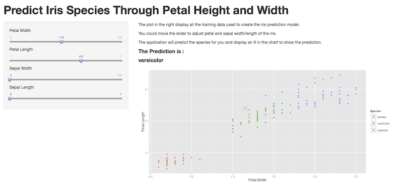
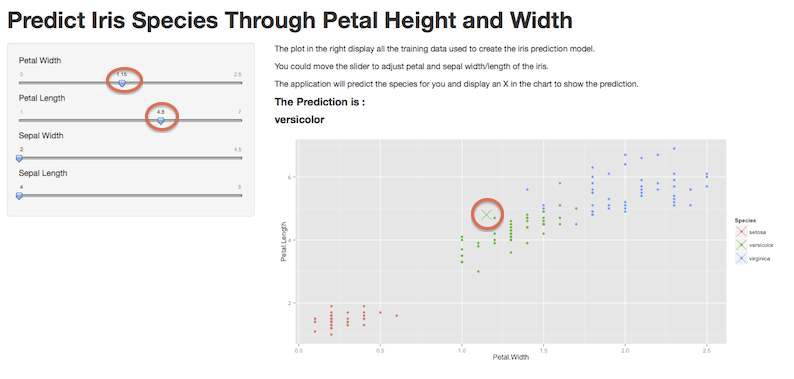

## iris Data classified well through simple variables

```{r fig.height=6}
data(iris);
qplot(Petal.Length, Petal.Width , col=Species, data=iris) + aes(x=Petal.Width, y=Petal.Length, col=Species)
```

---

## Use a decision tree to classify the data

```{r error=FALSE}
library(caret);library(rattle)
modelFit <- train(Species ~ ., method='rpart', data=iris)
fancyRpartPlot(modelFit$finalModel)
```
---

## Shiny Web App

Use Shiny to create web app to do prediction realtime



---

## Shiny Web App

* Move slider in left will move X mark in left
* The predicted species is marked by color and displayed in bold text.


