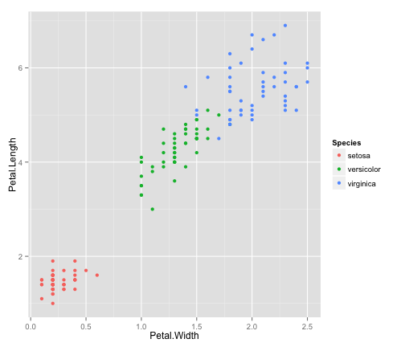
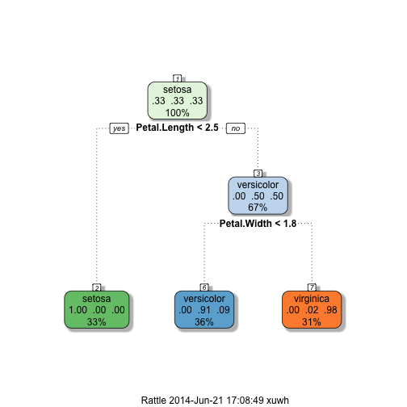
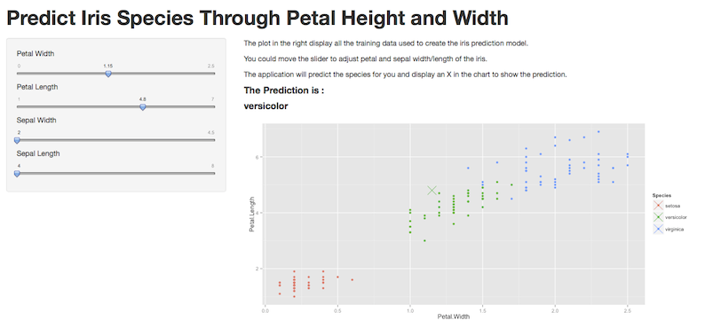
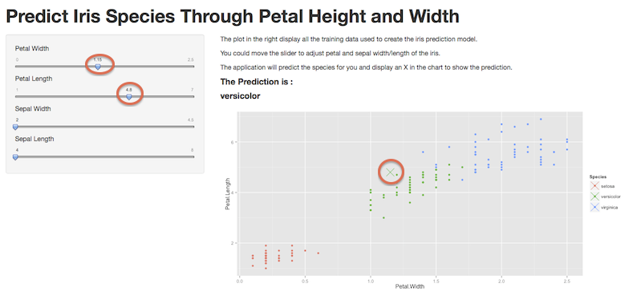

## iris Data classified well through simple variables


```r
data(iris)
qplot(Petal.Length, Petal.Width, col = Species, data = iris) + aes(x = Petal.Width, 
    y = Petal.Length, col = Species)
```

 


---

## Use a decision tree to classify the data


```r
library(caret)
library(rattle)
modelFit <- train(Species ~ ., method = "rpart", data = iris)
fancyRpartPlot(modelFit$finalModel)
```

 

---

## Shiny Web App

Use Shiny to create web app to do prediction realtime



---

## Shiny Web App

* Move slider in left will move X mark in left
* The predicted species is marked by color and displayed in bold text.


